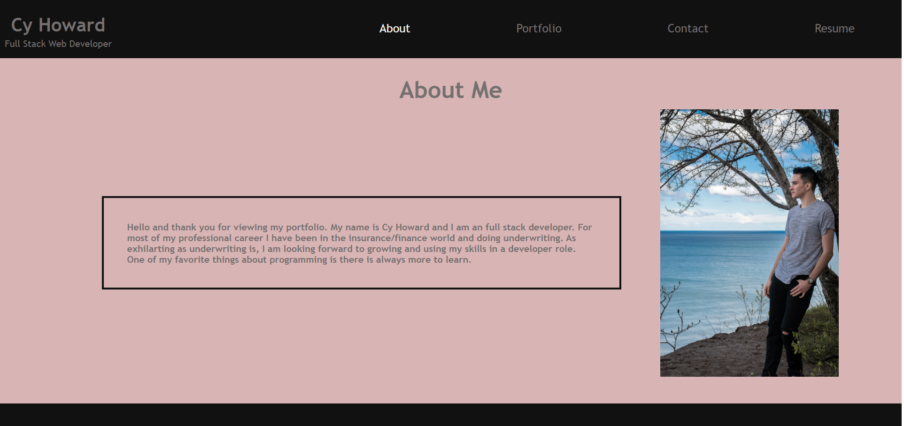

# updated-portfolio

## Purpose
This is my updated portfolio.

## Installation

After cloning the repository run `npm install` to install all the needed packages from the package.json file. 

## Built With
* React
* React Icons
* JavaScript
* CSS

## Usage
Run `npm start` to start the server. Then go to http://localhost:3000 to view the application.

Link to deployed website: https://howacy1.github.io/updated-portfolio/

## Contribution
Made by Cy Howard
